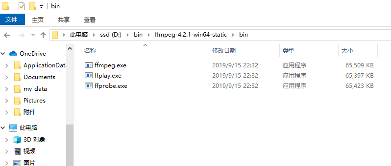
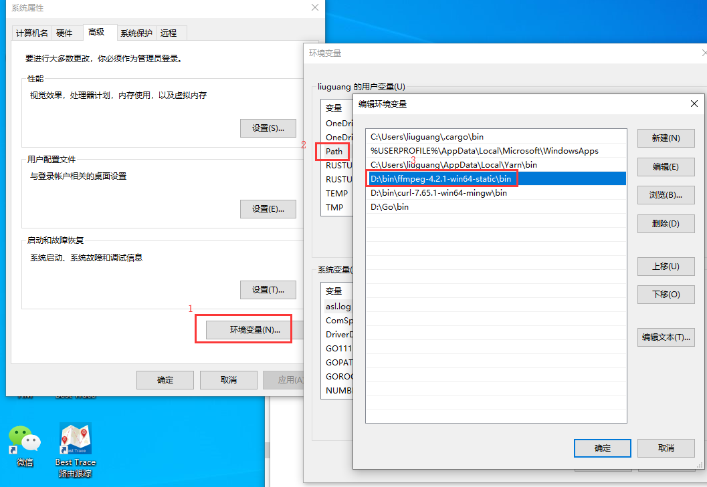
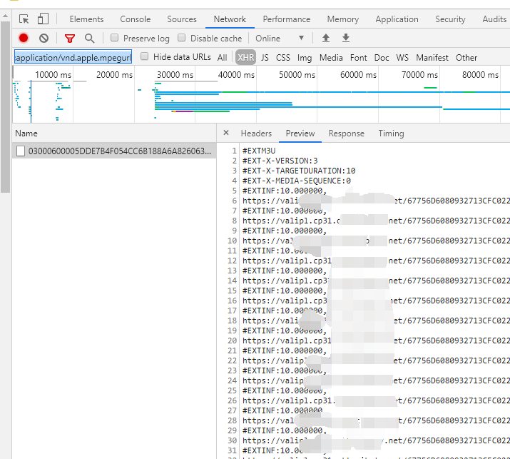

# m3u8_download
这是一个用来下载m3u8协议的视频的命令行工具。

- 可以随时强制中断任务,再次下载时，可以继续上次的下载。
- 支持加密的m3u8下载
- 下载完成后可以自动合并转码视频文件
- 下载进行中时，可以观看已下载部分的缓存内容

## 环境要求

使用之前，需要下载`ffmpeg`的二进制文件(用于下载后合并转码)，并将其加入系统的`PATH`环境变量。

例如我的win10，`ffmpeg`的目录如下




设置`PATH`环境变量



## 使用方法

```shell
#在命令行下执行
#m3u8_download 配置文件绝对路径
#例如下面的
m3u8_download /path/to/config.json
```

## 配置文件说明

配置文件的各字段说明

- **m3u8_url**   m3u8的url
- **encode_type** 有一个特别的网站的m3u8文件的内容是`base64`加密的,这种情况,写`base64`。其他情况，默认空字符串即可。
- **max_task** 同时下载的分片文件数
- **time_out** 下载文件时TCP连接的超时秒数。如果`time_out`秒还没有连接到远程服务器，则视为超时。
- **save_dir** 视频的保存目录,绝对路径,建议不要有中文，空格以免出错。
- **save_file_name** 保存视频的文件名称,建议不要有中文，空格。
- **clean_cache_after_success** 下载完成后是否清理分片缓存,布尔值`true`或者`false`
- **proxy** 网络代理配置。如HTTP代理`http://ip:port` ，HTTPS代理`https://ip:port` ，socket5代理 `socks5://ip:port`。如果留空，则程序会尝试读取`HTTP_PROXY`, `HTTPS_PROXY` 和 `NO_PROXY `环境变量(小写字母也支持)。
- **extra_headers** 额外的`HTTP`请求头设置，例如有的网站设置了**Referer**限制，就可以在此处设置。

## 获取m3u8下载地址

使用chrome浏览器，按下**F12**打开开发者工具，切换到network面板，刷新页面。

在filter中输入`m3u8`或者`mime-type:application/vnd.apple.mpegurl`



## 下载失败的情况

下载时，如果网络比较差，会有一定的机率出现某些分片下载失败。不过不用担心，程序会稍后尝试重新下载失败的分片，直到所有的分片下载成功。

## m3u8列表中的url过期的情况

m3u8文件实际上就是一个视频分片的url列表，一般情况下，列表中的url只是在一段时间内有效。

所以如果你的网络非常差，就有可能出现下了一部分视频分片，结果后面的分片过期了的情况。

其实本工具早就考虑过这种情况😁。视频网站通常会给分片文件设置一个有过期时间的临时url，然而视频分片还是那些分片，所以只要知道新的分片url，就可以接着下载，而无需重新从头开始下载。

只要去重新获取新的m3u8地址,修改配置文件的`m3u8_url`，最后重新运行命令即可。

## 支持中断下载

下载视频时，可以随机按下`CTRL` + `C` 来中断任务，重新运行命令时，可以接着下载。当然如果m3u8过期了，记得要更新配置文件。

## 边下边看

本程序可以一边下载，一边预览，前提是你已经将`ffplay`的二进制文件所在的目录，加入了系统`PATH`环境变量。

首先用命令行进入到配置文件中设置的视频保存目录，里面有一个`cache`文件夹。

进入之后，会有一个以视频文件名命令的文件夹。

这个文件夹就是**分片缓存文件夹**了，里面有一个`000local.m3u8`，使用`ffplay`播放此文件。


```shell
# 预览命令
# 必须cd到分片缓存文件夹执行命令
cd 分片缓存文件夹路径
ffplay 000local.m3u8
# 可以使用键盘的方向键来快进/快退，更多控制快捷键请参考ffplay
```

## 操作系统支持

本程序是使用Go语言编写的，所以可以运行在各种常见的操作系统下。

虽然这里的介绍以win为主，但是理论上这个工具是可以在Linux/mac下运行的，只要设置好ffmpeg环境，就可以一样的合并，转码。

